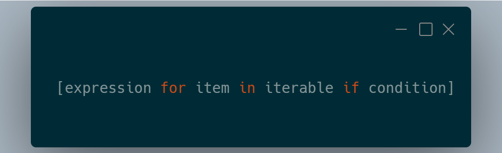

# List comprehensions

Zwięzły sposób na **tworzenie list** na podstawie iterowalnych\* struktur danych.

\* iteracja - powtarzanie tej samej operacji w pętli aż do osiągnięcia pewnego warunku zatrzymania (np. koniec zbioru)
___
### Składnia

 

**expression**: operacja, która zostanie zastosowana do każdego elementu

**item** - pojedynczy element z iterowanej sekwencji

**iterable** - sekwencja (uporządkowana grupa elementów), po której iterujemy (np. lista)

**condition** - opcjonalny warunek, który element musi spełniać, aby został dodany do nowej listy
___

