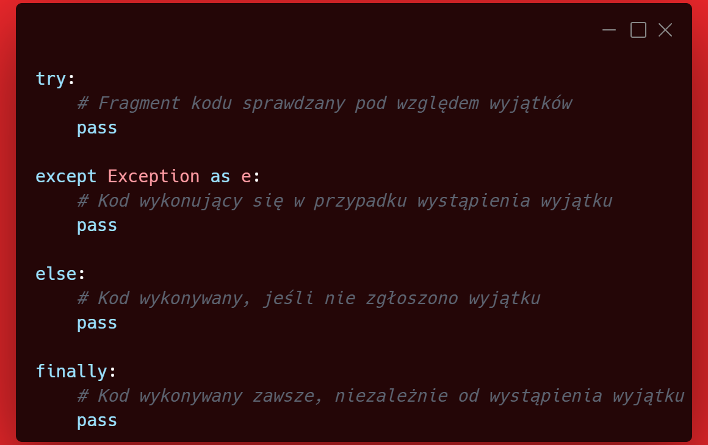

# Wyjątki / Exceptions

Jest to *mechanizm obsługi błędów*, który umożliwia reagowanie na różne (nie)przewidziane sytuacje - błędy w kodzie, kreatywne dane wejściowe lub problemy z zasobami.
___
### Przechwytywanie wyjątków

 

___
### Najczęstsze rodzaje wyjątków

### ZeroDivisionError
&nbsp;&nbsp;&nbsp;&nbsp;&nbsp;&nbsp;&nbsp;&nbsp;
dzielenie przez zero (niedopuszczalna operacja)

### OverflowError
&nbsp;&nbsp;&nbsp;&nbsp;&nbsp;&nbsp;&nbsp;&nbsp;
obliczenia przekraczają zakres typu zmiennej

### FloatingPointError
&nbsp;&nbsp;&nbsp;&nbsp;&nbsp;&nbsp;&nbsp;&nbsp;
błędy w operacjach na liczbach zmiennoprzecinkowych

### AttributeError
&nbsp;&nbsp;&nbsp;&nbsp;&nbsp;&nbsp;&nbsp;&nbsp;
przypisanie lub odczyt atrybutu są nieprawidłowe

### EOFError
&nbsp;&nbsp;&nbsp;&nbsp;&nbsp;&nbsp;&nbsp;&nbsp;
program natrafia na koniec pliku (EOF) bez uprzedniego pobrania danych

### ImportError
&nbsp;&nbsp;&nbsp;&nbsp;&nbsp;&nbsp;&nbsp;&nbsp;
nie udaje się zaimportować modułu

### IndexError
&nbsp;&nbsp;&nbsp;&nbsp;&nbsp;&nbsp;&nbsp;&nbsp;
indeks sekwencji jest poza zakresem

### KeyError
&nbsp;&nbsp;&nbsp;&nbsp;&nbsp;&nbsp;&nbsp;&nbsp;
klucz nie jest obecny w słowniku

### MemoryError
&nbsp;&nbsp;&nbsp;&nbsp;&nbsp;&nbsp;&nbsp;&nbsp;
nie można przydzielić pamięci

### FileNotFoundError
&nbsp;&nbsp;&nbsp;&nbsp;&nbsp;&nbsp;&nbsp;&nbsp;
plik nie istnieje

### PermissionError
&nbsp;&nbsp;&nbsp;&nbsp;&nbsp;&nbsp;&nbsp;&nbsp;
brak odpowiednich uprawnień

### TypeError
&nbsp;&nbsp;&nbsp;&nbsp;&nbsp;&nbsp;&nbsp;&nbsp;
operacja lub funkcja stosowana jest do obiektu niewłaściwego typu

### ValueError
&nbsp;&nbsp;&nbsp;&nbsp;&nbsp;&nbsp;&nbsp;&nbsp;
funkcja otrzymała argument o niewłaściwej wartości

### RuntimeError
&nbsp;&nbsp;&nbsp;&nbsp;&nbsp;&nbsp;&nbsp;&nbsp;
wyjątki, które nie pasują do żadnej innej kategorii

### SyntaxError
&nbsp;&nbsp;&nbsp;&nbsp;&nbsp;&nbsp;&nbsp;&nbsp;
błąd składniowy

### IndentationError
&nbsp;&nbsp;&nbsp;&nbsp;&nbsp;&nbsp;&nbsp;&nbsp;
niepoprawne wcięcia (tabulatury)

